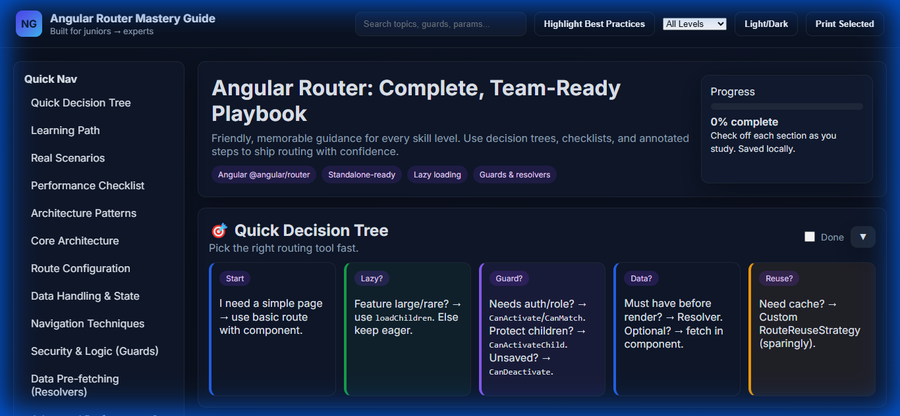

# Angular Router Mastery Guide 🎯

A comprehensive, beautifully designed interactive study guide for mastering Angular Routing (`@angular/router`). Perfect for developers at all levels - from juniors to experts.




## ✨ Features

### 📚 Comprehensive Content
- **13 Core Sections** covering all Angular routing concepts
- **Simple Explanations** - Concepts explained like you're 5
- **Decision Trees** - Visual guides for choosing the right approach
- **Step-by-Step Implementation** - Copy-paste ready workflows
- **Real-World Scenarios** - E-commerce, admin dashboards, and more
- **Architecture Patterns** - Enterprise-grade routing strategies

### 🎨 Visual Learning
- **Color-Coded Callouts** - Info (blue), Best Practices (green), Cautions (yellow), Warnings (red), Architecture (purple)
- **Learning Path Badges** - Beginner, Intermediate, Advanced sections
- **Annotated Code Examples** - Every line explained
- **Quick Summary Cards** - TL;DR for rapid recall

### 🛠️ Interactive Features
- **Collapsible Sections** - Expand only what you're studying
- **Learning Path Filter** - Show only beginner/intermediate/advanced content
- **Search & Highlight** - Find any topic instantly
- **Copy Code Buttons** - One-click code copying
- **Bookmarks** - Star important sections
- **Personal Notes** - Add your own notes per section (saved locally)
- **Progress Tracking** - Check off completed sections
- **Dark/Light Mode** - Choose your preference
- **Print Selected** - Export only the sections you need

## 🚀 Quick Start

1. **Clone the repository**
   ```bash
   git clone https://github.com/YOUR_USERNAME/angular-routing-guide.git
   cd angular-routing-guide
   ```

2. **Open in browser**
   ```bash
   # Simply open index.html in your browser
   # Or use a local server:
   npx serve .
   # Then visit http://localhost:3000
   ```

3. **Start learning!**
   - Select your learning path (Beginner/Intermediate/Advanced)
   - Use the sidebar to navigate topics
   - Bookmark important sections
   - Add personal notes as you learn

## 📖 What's Covered

### Core Topics
1. **Routes & Architecture** - Understanding the routing system
2. **Route Configuration** - Basic, lazy loading, wildcards
3. **Data Handling** - Params, query params, ActivatedRoute
4. **Navigation** - RouterLink, programmatic navigation
5. **Route Guards** - CanActivate, CanDeactivate, CanMatch
6. **Resolvers** - Pre-fetching data
7. **Performance** - Events, preloading strategies
8. **Router Outlets** - Primary and named outlets
9. **RouterLink Essentials** - Active states, options
10. **Patterns & Edge Cases** - Real-world gotchas
11. **Quick Reference** - Cheat tables
12. **Project Setup** - Standalone app skeleton
13. **Best Practices** - Team-ready guidelines

### Special Sections
- 🎯 **Quick Decision Tree** - "Which routing feature do I need?"
- 📚 **Learning Path** - Structured curriculum
- 🔥 **Real Project Scenarios** - Practical implementations
- ⚡ **Performance Checklist** - Pre-launch optimization
- 🎨 **Architecture Patterns** - Scalable routing designs

## 🎓 Who Is This For?

- **Juniors** - Learn Angular routing from scratch with simple explanations
- **Intermediate** - Deepen your understanding with architecture notes
- **Seniors** - Quick reference and best practices for project decisions
- **Teams** - Shared knowledge base and standards
- **Interviewers** - Comprehensive coverage of routing concepts

## 💡 How to Use This Guide

### For Learning
1. Start with "Learning Path: Beginner" filter
2. Read "Simple Explanation" and "Why You Need It" in each section
3. Follow "Step-by-Step Implementation" guides
4. Check off sections as you complete them
5. Add personal notes for future reference

### For Projects
1. Use "Quick Decision Tree" to find the right approach
2. Jump to specific sections via search or TOC
3. Copy code examples directly
4. Review "Best Practices" and "Common Mistakes"
5. Check "Architecture Notes" for team coordination

### For Interviews
1. Use "Highlight Best Practices" button
2. Review "Quick Summary Cards" at the end of sections
3. Study "Real Project Scenarios"
4. Focus on "Common Mistakes" sections

## 🤝 Contributing

Contributions are welcome! If you find errors or want to add content:

1. Fork the repository
2. Create a feature branch (`git checkout -b feature/improvement`)
3. Make your changes
4. Commit (`git commit -m 'Add some improvement'`)
5. Push (`git push origin feature/improvement`)
6. Open a Pull Request

## 📄 License

MIT License - feel free to use for personal or commercial projects.

## 🙏 Acknowledgments

Inspired by the teaching style of popular Angular educators and built with care for the developer community.

---

**Made with ❤️ for the Angular community**

⭐ Star this repo if you find it helpful!

